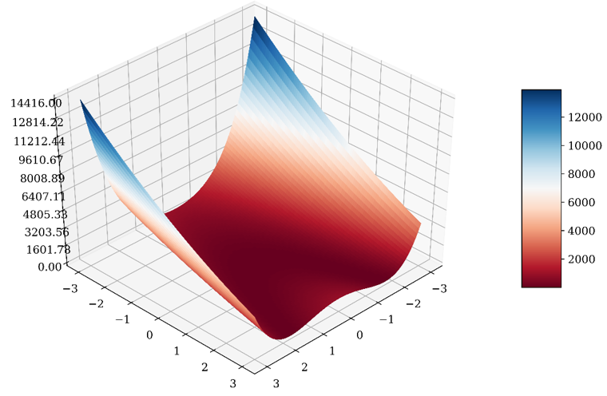

# optim-benchmark: Benchmarking gradient-free optimisers on synthetic functions

## Overview

This repository benchmarks various gradient-free (black-box) optimisers on synthetic functions. Specifically, we look at the following variables when considering standard benchmark functions:

* Noise
* Dimensions
* Effects of logarithms

## Usage

The code is designed to work with **Python 3.6.1+**. All required libraries are listed in `requirements.txt`, but the key ingredients are `nevergrad`, `cma`, `scikit-optimize` and `bayesian-optimization`. We recommend creating an environment using [Miniconda](https://docs.conda.io/en/latest/miniconda.html).

```bash
git clone https://github.com/lazyoracle/optim-benchmark
cd optim-benchmark
conda create --name=benchmark python==3.6.1
conda activate benchmark
pip install -r requirements.txt
jupyter lab --port 4242 demo_notebook.ipynb
```

## Optimisation Algorithms & Benchmark Functions

The algorithm and some of the benchmark function implementations are taken from. While the code should work with all algorithms listed in `nevergrad`, we specifically look at the following here:

* CMA
* Random Search
* Noisy Bandit
* Powell’s
* SPSA
* Differential Evolution
* PSA
* (1+1)
* Particle Swarm
* Nelder Mead
* Bayesian Optimisation
* Estimation of Distribution

We test the above algorithms on the following synthetic functions:

* Translated Sphere

* Rosenbrock

* Ill-Conditioned

* Multimodal

* Path-Function


This is a visual representation of what the landscape of these functions typically look like:

## Results

We group the combined effects of function landscape, noise and dimensions into *Easy*, *Medium*, *Medium-Hard* and *Hard* and study the minimisation of the funtion as the algorithm progresses with more function evaluations. The code is also designed to study the number of evaluations that would be required to reach a specific `f_min` goal.

Some preliminary results can be seen below:

### Easy

> * Convex (translated sphere)
> * noise 0.03
> * dimension 3
> * X: log-scale evaluations
> * Y: log-scale goal


### Hard

> * Ill-Conditioned
> * noise 0.1
> * dimension 1000
> * X: log-scale evaluations
> * Y: log-scale goal


### Number of Evaluations to a Goal

> * Rosenbrock
> * noise 0.1
> * Goal 1e-7


More details on preliminary results can be seen in the [presentation from July 2019](benchmark_optimisers_anurag.pdf)
